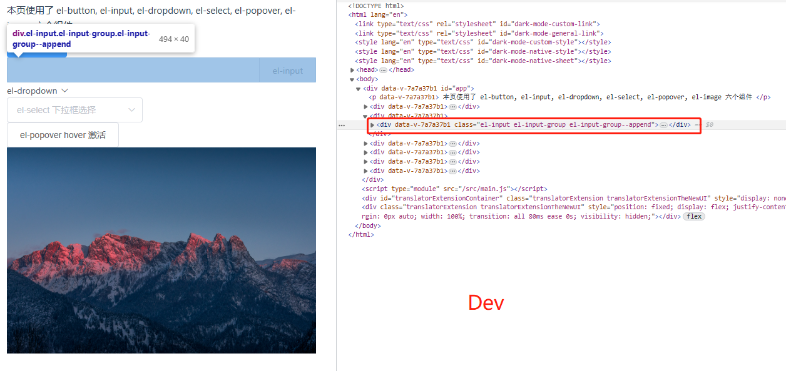
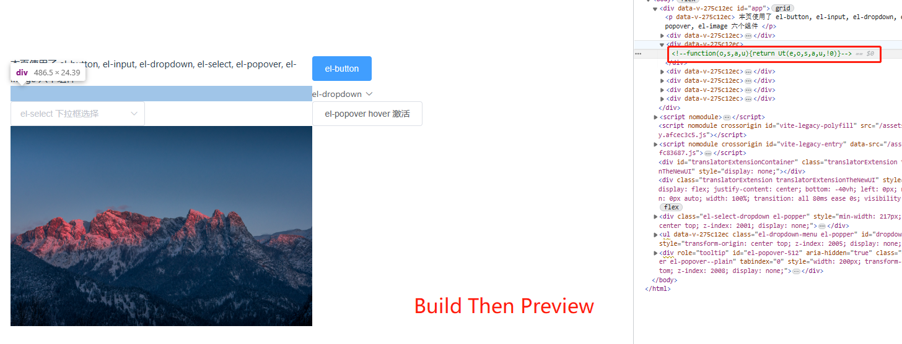

# 创建项目
```shell
  npm create vue@lagacy
```

# 安装 element-ui
```shell
  npm i -S element-ui
```

# 参考 [Element-Plus/快速开始#按需引入](https://element-plus.org/zh-CN/guide/quickstart.html#%E6%8C%89%E9%9C%80%E5%AF%BC%E5%85%A5) 的方式引入 element-ui

1. 安装相关依赖
```shell
  npm install -D  unplugin-vue-components  unplugin-auto-import
``` 
2. 配置 vite （将 *ElementPlusResolver* 替换为 *ElementUiResolver*）

```js
// vite.config.js
import { fileURLToPath, URL } from "node:url";

import { defineConfig } from "vite";
import legacy from "@vitejs/plugin-legacy";
import vue2 from "@vitejs/plugin-vue2";
import AutoImport from "unplugin-auto-import/vite";
import Components from "unplugin-vue-components/vite";
import { ElementUiResolver } from "unplugin-vue-components/resolvers";

// https://vitejs.dev/config/
export default defineConfig({
  plugins: [
    vue2(),
    legacy({
      targets: ["ie >= 11"],
      additionalLegacyPolyfills: ["regenerator-runtime/runtime"],
    }),
    AutoImport({
      resolvers: [ElementUiResolver()],
    }),
    Components({
      resolvers: [ElementUiResolver()],
    }),
  ],
  resolve: {
    alias: {
      "@": fileURLToPath(new URL("./src", import.meta.url)),
    },
  },
});

```

# 使用
直接在 [App.vue](./src/App.vue) 中使用 element-ui 的组件，开发时没啥问题，打包后某些组件会“丢失”如 `el-input, el-select, el-popover` 等(不一定是这几个)。
```shell
### 开发
npm run dev
```


```shell
### 打包并预览问题
npm run build && npm run preview
```


<style>
  img {
    display: block;
    margin: auto;
    width: 70%;
  }
</style>
